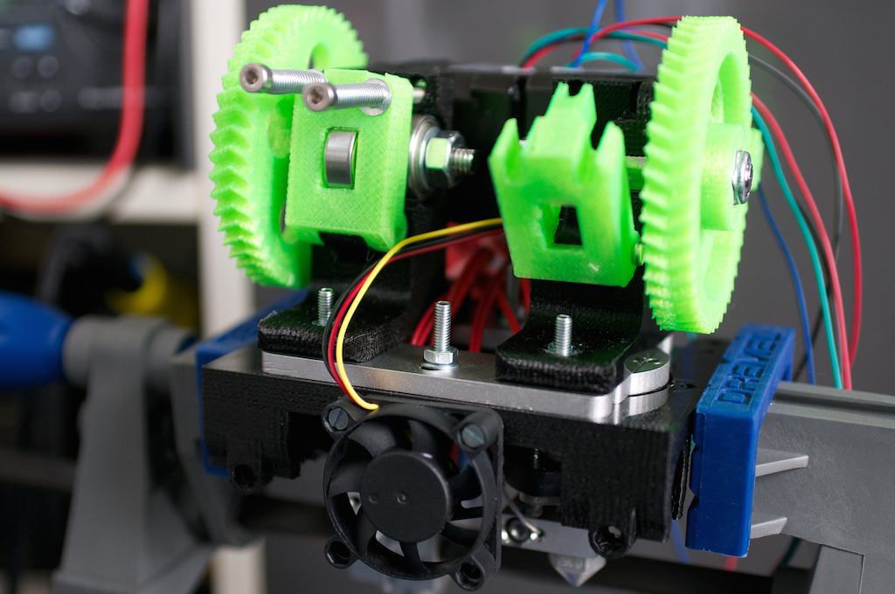

dual-budaschnozzle-x-carriage
=============================

A X-carriage for the [Geetech Dual-head Hotend Extruder](http://www.geeetech.com/dualhead-hotend-extruder-0350405mm-nozzle-for-3mm-filament-p-749.html) which uses two budaschnozzle.

Made for Mendel-style horizontal X-axis printers.

Requires two short nema17 steppers. Designed for 3mm filament but can be changed.

## Note

This a work in progress, it's not functional yet.

Things to needs to be designed for it to be complete:

 - [x] Belt clamps for GT2 belts.
 - [ ] Mount plate clamps
 - [ ] fan duct for the front fan to cool down the top part of the hotends

