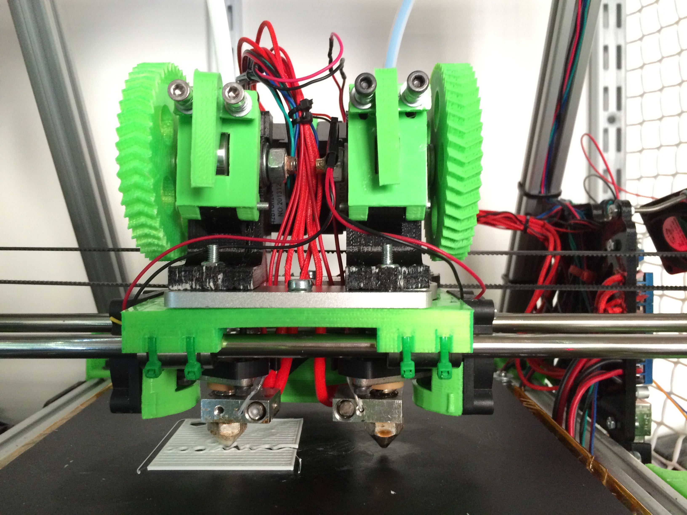
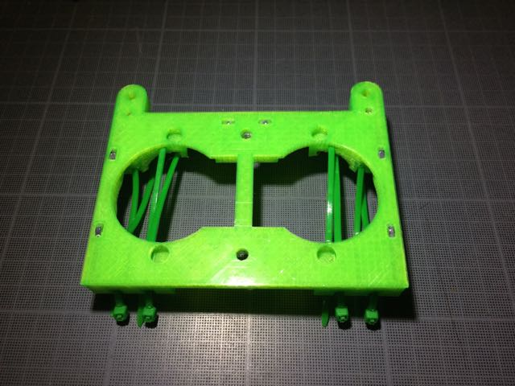
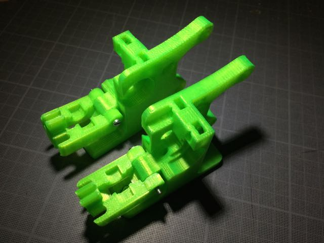
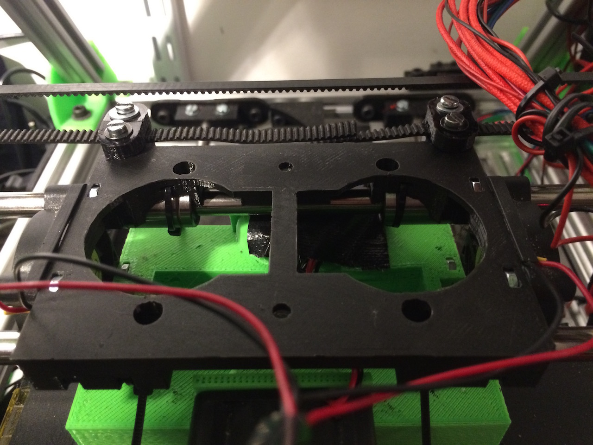

dual-budaschnozzle-x-carriage
=============================

A X-carriage for the [Geetech Dual-head Hotend](http://www.geeetech.com/dualhead-hotend-extruder-0350405mm-nozzle-for-3mm-filament-p-749.html) which uses two budaschnozzles.

Made for Mendel-style horizontal X-axis printers. Has emplacements for three 40mm fans, two on the sides for cooling the buda's radiators and one in the back for cooling the print.

Use a derivative of [Greg's Wade realoaded](http://www.thingiverse.com/thing:18379) extruder.

Requires two short nema17 steppers. Designed for 3mm filament but can be changed in the configuration.

## Status

Working.

## Instructions

### Print
    
 * x-carriage
 * extruder bodies
 * extruder idlers
 * belt clamps
 * two pairs of gears (big and small)
 * (*optional*) [Rear fan duct](http://www.thingiverse.com/thing:535374) or other fan duct with requires M3 holes at 15 mm spacing.

### X-Carriage

 * On the underside of the x-carriage, glue two M5 nuts and two M3 nuts in their respective nut traps and insert 8 zip ties in the lm8uu holders.
 * On the sides of the x-carriage, insert two M3 nuts in side nut catches. Clean the holes before hand if there is any obstructions visible.
 * On the top of the x-carriage, insert 6 M3 nuts in the top nut catches.

### Extruders

 * Setup is identical as the [original version](http://www.thingiverse.com/thing:18379)
 * insert some filament in the extruder so that it sticks through the underside and use that for alignment with the mount plate. Use two M4 bolts on each side, flat heads preferably but others may work. **The stepper motors should be on the inside**

### Final assembly

 * screw in the fans and the rear fan duct with M3 bolts
 * put the x-carriage on top of the lm8uus on the x-axis rails, secure it with the zip-ties
 * add the belt clamps on either side and secure them with M3 bolts
 * put the hotends mount plate with the extruders attached on the x-carriage, the M4 bolt's heads should fit in the holes in the x-carriage, if not check for alignment.
 * secure it using two short M5 bolts using the two central slits on the mount plate

