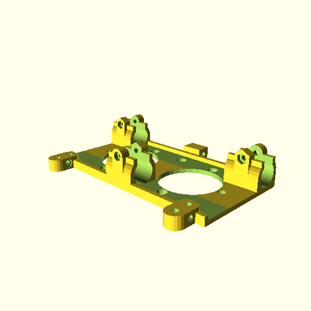

dual-budaschnozzle-x-carriage
=============================

A X-carriage for the [Geetech Dual-head Hotend Extruder](http://www.geeetech.com/dualhead-hotend-extruder-0350405mm-nozzle-for-3mm-filament-p-749.html) which uses two budaschnozzle.

