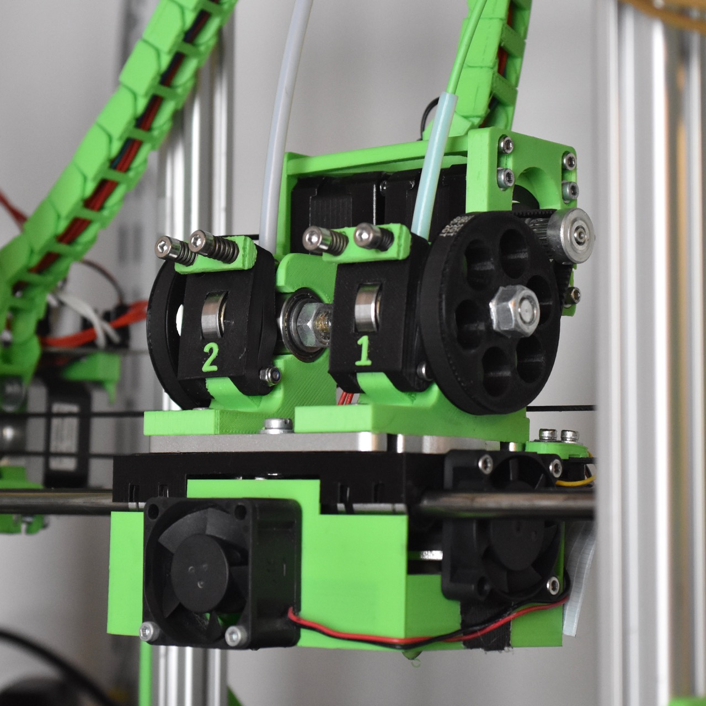
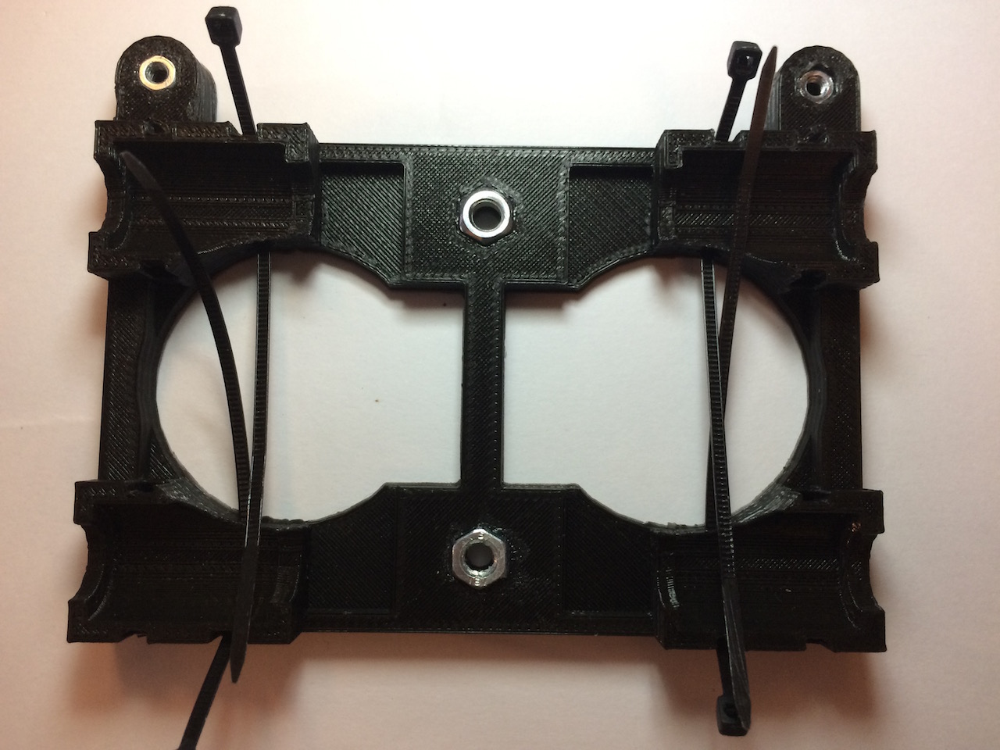

dual-budaschnozzle-x-carriage
=============================

A combination of X-carriage (black), extruders (blue), and fanduct/thermal shield (green) for the [Geetech Dual-head Hotend](http://www.geeetech.com/dualhead-hotend-extruder-0350405mm-nozzle-for-3mm-filament-p-749.html) which uses two budaschnozzles.

Made for Mendel-style horizontal X-axis printers. Has emplacements for four 40mm fans, two on the sides for cooling the buda's radiators and two for cooling the print.

Requires two short nema17 steppers. Designed for 3mm filament but can be changed in the configuration. The beltclamps are designed for a gt2 belt.

## Status

Working, with small caveats. 

 * The filament is a bit difficult to insert through the extruder.
 * The x-carriage doesn't render correctly in recent versions of openscad for some reasons. I had to use netfabb to repair it.

 Dozens and dozens of hours of printing have been achieved with this setup, here is some [print results](https://www.flickr.com/photos/reefab_projects/albums/72157651943218993).

## Instructions

### Required Hardware

Beyond the standard hardware you'll need:

 * 4x 40mm fans
 * Aluminum foil tape
 * a [Magic Eraser](https://en.wikipedia.org/wiki/Melamine_foam) (no, really)
 * Kapton tape

### Print
    
 * X-carriage
 * Extruder bodies
 * Extruder idlers
 * Pair of belt clamps
 * Two pairs of gears (big and small)
 * Fan duct 

 I printed everything in PLA at 40% infill expect for the fanduct that uses 10% infill (and benefit from being printed in ABS).

### X-Carriage

 * On the underside of the x-carriage, glue two M5 nuts and two M3 nuts in their respective nut traps and insert 4-8 zip ties in the lm8uu holders.
 * On the sides of the x-carriage, insert two M3 nuts in side nut catches. Clean the holes before hand if there is any obstructions visible.
 * On the top of the x-carriage, insert 4 M3 nuts in the top nut catches.

**NOTE**: Gluing the bottom nuts is heavily recommended, they will be very difficult to replace without taking the whole assembly apart if they fall.

### Extruders

 * Setup is identical as the [original version](http://www.thingiverse.com/thing:18379)
 * Insert some filament in the extruder so that it sticks through the underside and use that for alignment with the mount plate. Use two M4 screws on each side, flat heads preferably but others may work. Self locking nuts are recommended, or just use two nuts. **The stepper motors should be on the inside**

**NOTE**: Do not over-tighten the m4 nuts, you may need to slide the extruders a bit on the mount plate for the correct alignment.

### Fanduct/Thermal shield

This part has two fans and nozzles to direct cooling air flow on the printed part. It is affixed to the x-carriage using the two side fans used for cooling the fins of the hotends radiators. Dual extrusion printing means that when a particular hotend is not printing, the warm filament will sit still and expand, eventually getting stuck, hence the side fans sitting very close to the radiator fins with directed airflow.

The fanduct directs air to the plastic being extruded as close to the hotend nozzle as possible as it gets the best results in my experience. The airflow also comes from 3 directions to prevent one side getting more cooling that the others as it results in visible artifacts on the printed piece.

Its purpose is also to prevent thermal radiation from the heating block transmitting to the printed part. Those particular hotends have a big heating block that radiates a lot of heat (in part due to their material), cooling only goes so far in remediating that so the best way to prevent the heat from going to the printed piece.

To achieve that, the hotend is almost completely enclosed.

Of course, blocking the heat using the same plastic that the hotend is designed to melt is a bit difficult. To help with that, thermal insulation is required. The main component is [Melamine Foam](https://en.wikipedia.org/wiki/Melamine_foam), it has excellent insulation, will resists the usual temperatures without issues and can be bought in pretty much any supermarkets for a pitance. Ceramic wool might be a better choice, but to stay in the RepRap's spirit, I preferred using widely available materials.

 * On the top of the fanduct, insert 4 M3 nuts in the top nut catches and 4 in the bottom ones
 * Screw in the front and back fans

### Insulation installation

 Apply the foil tape to the inside well and poke holes in it, I used three layers
 Cut the Magic Eraser pad to fit inside the well and cut holes. You'll notice that it almost fill the inside of the well but don't worry, it compress very well.
 Put some kapton tape on top of the foam and cut holes

*Caveat*: after dozens of hours of printing, this fanduct that I printed in PLA is slightly sagging just below the heating block. It doesn't seem to cause issues.

### Final assembly

 * Put the x-carriage on top of the lm8uus on the x-axis rails, secure it with the zip-ties
 * Add the belt clamps on either side and secure them with M3 screws
 * Put the hotends mount plate with the extruders attached on the x-carriage, the M4 bolt's heads should fit in the holes in the x-carriage, if not check for alignment.

 * Secure it using two short M5 screws using the two central slits on the mount plate
 * Screw in the fans and the fan duct with M3 screws

### Source

 * Extruders: [Greg's Wade reloaded](http://www.thingiverse.com/thing:18379) by jonaskuehling.
 * X-carriage: [Reinforced Prusa X Carriage with Slim LM8UU Holder](http://www.thingiverse.com/thing:18657) by jonaskuehling.
