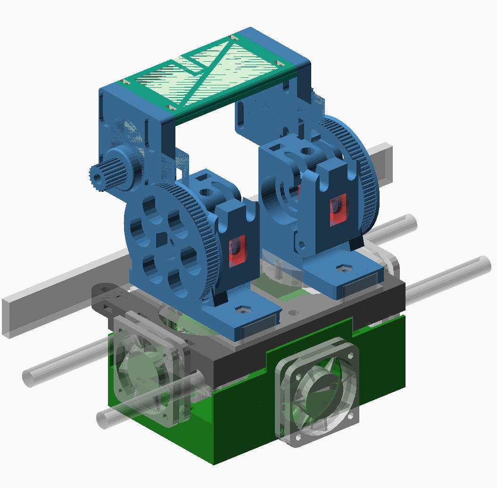
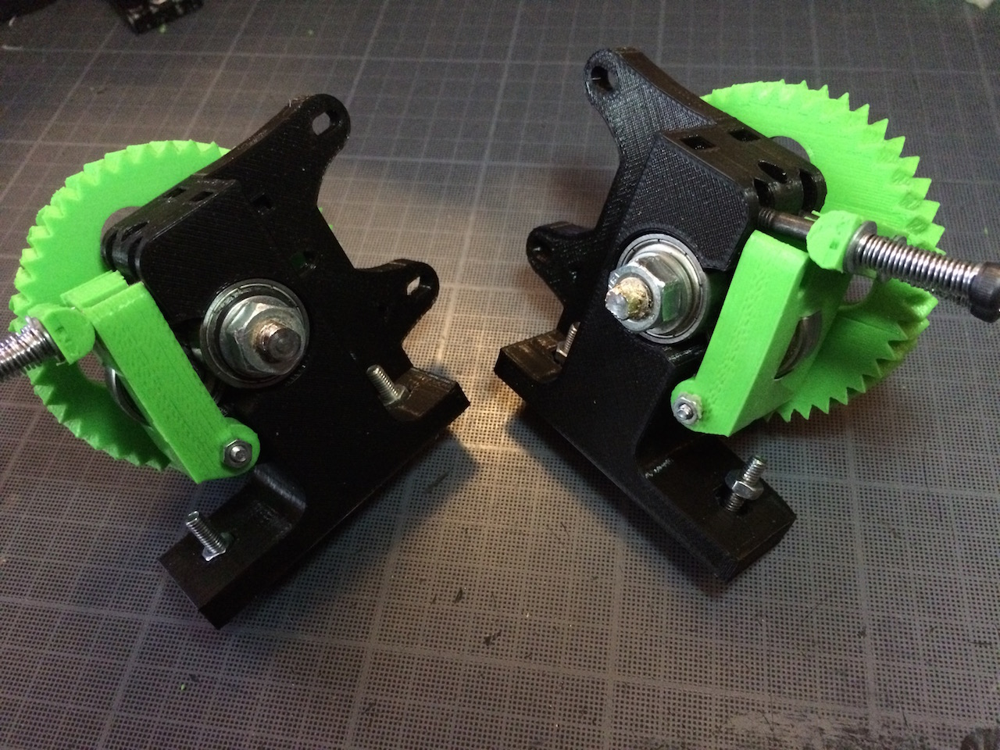

dual-budaschnozzle-x-carriage
=============================

A combination of X-carriage (black), extruders (blue), and fanduct/thermal shield (green) for the [Geetech Dual-head Hotend](http://www.geeetech.com/dualhead-hotend-extruder-0350405mm-nozzle-for-3mm-filament-p-749.html) which uses two budaschnozzles.

Made for Mendel-style horizontal X-axis printers. Has emplacements for three 40mm fans, two on the sides for cooling the buda's radiators and one in the back for cooling the print.

Requires two short nema17 steppers. Designed for 3mm filament but can be changed in the configuration.

## Status

Working. With small caveats.
Documentation and pictures needs to be updated.

## Instructions

### Print
    
 * X-carriage
 * Extruder bodies
 * Extruder idlers
 * Pair of belt clamps
 * Two pairs of gears (big and small)
 * Fan duct 

### X-Carriage

 * On the underside of the x-carriage, glue two M5 nuts and two M3 nuts in their respective nut traps and insert 8 zip ties in the lm8uu holders.
 * On the sides of the x-carriage, insert two M3 nuts in side nut catches. Clean the holes before hand if there is any obstructions visible.
 * On the top of the x-carriage, insert 4 M3 nuts in the top nut catches.

### Extruders

 * Setup is identical as the [original version](http://www.thingiverse.com/thing:18379)
 * Insert some filament in the extruder so that it sticks through the underside and use that for alignment with the mount plate. Use two M4 screws on each side, flat heads preferably but others may work. **The stepper motors should be on the inside**

### Fanduct/Thermal shield

This part has two fans and nozzles to direct cooling air flow on the printed part. It is affixed to the x-carriage using the two side fans used for cooling the fins of the hotends radiators.

Its purpose is also to prevent thermal radiation from the heating block transmitting to the printed part. To achieve that, the hotend is almost completely enclosed.

Isolation is a work in progress. So far I'm using melamine foam. **TODO**: better documentation and pictures of thermal isolation.

*Caveat*: after dozens of hours of printing, this fanduct that I printed in PLA is slightly sagging just below the heating block. 

 * On the top of the fanduct, insert 4 M3 nuts in the top nut catches.
 * Screw in the front and back fans in the plastic without using nuts.

### Final assembly

 * Screw in the fans and the fan duct with M3 screws
 * Put the x-carriage on top of the lm8uus on the x-axis rails, secure it with the zip-ties
 * Add the belt clamps on either side and secure them with M3 screws
 * Put the hotends mount plate with the extruders attached on the x-carriage, the M4 bolt's heads should fit in the holes in the x-carriage, if not check for alignment.
 * Secure it using two short M5 screws using the two central slits on the mount plate

### Source

 * Extruders: [Greg's Wade reloaded](http://www.thingiverse.com/thing:18379) by jonaskuehling.
 * X-carriage: [Reinforced Prusa X Carriage with Slim LM8UU Holder](http://www.thingiverse.com/thing:18657) by jonaskuehling.
